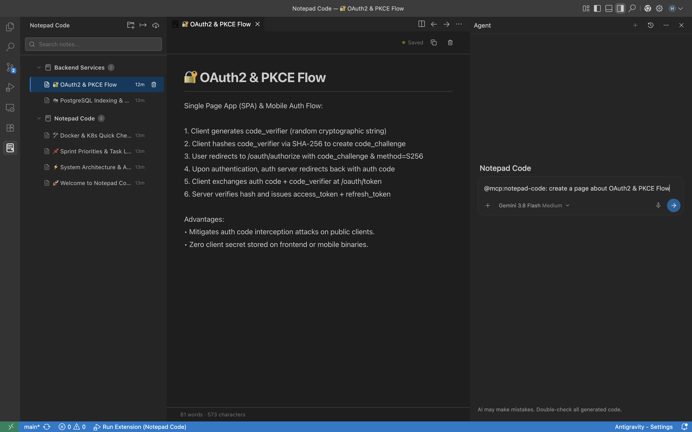

<div align="center">

# 📓 Notepad Code

**The Minimalist, AI-Native Developer Notepad for Modern IDEs**

[](https://github.com/cancakmk/NotepadCode/releases)
[](LICENSE)
[](https://www.typescriptlang.org/)
[](https://marketplace.visualstudio.com/)
[](https://modelcontextprotocol.io/)
[](package.json)



<p align="center">
  A theme-adaptive, distraction-free notebook & page organizer engineered for <b>VS Code</b>, <b>Cursor</b>, <b>Windsurf</b>, and <b>Google Antigravity</b>.<br/>
  Featuring <b>zero-config multi-IDE Model Context Protocol (MCP)</b>, real-time bi-directional disk sync, and native <b>GitHub Copilot</b> language tools.
</p>

[Key Features](#-key-features) •
[Why Notepad Code?](#-why-notepad-code) •
[Multi-IDE AI Integration](#-multi-ide--ai-integration) •
[MCP Tools Reference](#-mcp-tools-reference) •
[Architecture](#-architecture) •
[Quick Start](#-quick-start) •
[Contributing](#-contributing) •
[License](#-license)

</div>

---

## 💡 Why Notepad Code?

Every developer takes notes while coding — architecture decisions, terminal snippets, API payloads, debugging thoughts, and daily TODO lists. Yet, existing approaches introduce constant friction:

| Traditional Approach | The Problem | How Notepad Code Solves It |
| :--- | :--- | :--- |
| **Workspace `.txt` / `.md` files** | Clutters Git history; notes vanish when switching git branches or working on different repositories. | **Global Central Storage (`~/.notepad-code/`):** Accessible in every project, workspace, or empty window. |
| **External Note Apps (Notion, Obsidian, Apple Notes)** | Constant context-switching away from your code editor; requires alt-tabbing and manual copy-pasting. | **Native IDE Experience:** Sleek sidebar explorer and full distraction-free tab editor right inside your workflow. |
| **AI Assistants (Cursor, Copilot, Claude)** | AI has zero memory of your scratchpad notes unless you manually re-paste them into chat prompts. | **Universal MCP & Copilot Tools:** AI agents read, write, search, and update your notes autonomously and safely. |
| **Unwanted AI Markdown Clutter** | LLMs often pollute plain notes with awkward `#`, `**`, or code fences. | **Clean Normalization Engine:** Strips AI-generated formatting quirks, keeping notes tidy and readable. |

---

## ✨ Key Features

### 🌐 Universal Cross-Workspace Storage
Your notes don't belong to a single git repository. Notepad Code stores everything in a central, standardized JSON database at `~/.notepad-code/notepad-code-data.json`. Whether you open a tiny script or a massive monorepo, your notebooks are always there.

### 🤖 Zero-Config Multi-IDE AI Integration
No JSON configuration hassles. Upon activation, Notepad Code automatically detects installed IDEs and registers its standalone Model Context Protocol (MCP) server across:
- **Cursor** (`~/.cursor/mcp.json` & `.cursor/mcp.json`)
- **Google Antigravity** (`~/.gemini/config/mcp_config.json`)
- **Windsurf** (`~/.codeium/windsurf/mcp_config.json`)
- **Claude Desktop** (`claude_desktop_config.json` on macOS, Windows, Linux)
- **VS Code** (11 native Language Model Tools + `@notepad` Chat Participant)

### ⚡ Real-Time Live Disk Synchronization
When an AI agent (such as Cursor Composer or Antigravity) creates, updates, or deletes a note in the background, your active editor and sidebar update **instantly and automatically** via an integrated file watcher — no reload required.

### 🛡️ Accidental Data Loss Prevention (Guardrails)
Notepad Code protects your data with a dual-layer confirmation model:
- **VS Code Copilot:** Prompts native confirmation dialogs displaying target note details before executing destructive actions.
- **MCP Protocol:** Requires explicit confirmation parameters (`confirm: true`) for deletions and imports, preventing rogue AI actions.

### 🎨 Distraction-Free Monochrome Aesthetic
Designed around pure black (`#000000`) and pure white (`#FFFFFF`) palette tokens that adapt dynamically to your VS Code theme (Dark, Light, High Contrast). Crisp borders, bespoke SVG icons, word/character live counters, and zero visual noise.

### 🧭 Quick Action Controls
- **Sidebar Header Buttons:** `New Notebook`, `Export JSON`, `Import JSON` right from the view title.
- **Pinning:** Keep critical cheat-sheets and TODOs pinned to the top.
- **Instant Search:** Fuzzy search across all notebooks and pages simultaneously.
- **Full Tab Editor:** Distraction-free editing tab with real-time auto-saving.

---

## 🤖 Universal MCP Architecture (Multi-IDE)

Notepad Code is built entirely around the open **Model Context Protocol (MCP)**. All IDEs connect to the unified Notepad Code MCP server, which manages local persistence and bi-directional real-time synchronization:

```
                    ┌───────────────────────────────────────────┐
                    │    ~/.notepad-code/notepad-code-data.json │
                    │           (Central JSON Storage)          │
                    └─────────────────────┬─────────────────────┘
                                          │  Direct Read / Write / Watch
                    ┌─────────────────────┴─────────────────────┐
                    │       Notepad Code MCP Server             │
                    │           (mcp/server.js)                 │
                    │       Model Context Protocol (stdio)      │
                    └─────────────────────┬─────────────────────┘
                                          │
        ┌───────────────────┬─────────────┼─────────────┬───────────────────┐
        ▼                   ▼             ▼             ▼                   ▼
 ┌─────────────┐     ┌─────────────┐┌───────────┐┌─────────────┐     ┌─────────────┐
 │   VS Code   │     │   Cursor    ││Antigravity││  Windsurf   │     │ Claude / Zed│
 │ (.vscode/   │     │ (.cursor/   ││(~/.gemini/││(~/.codeium/ │     │(claude_desk/│
 │  mcp.json)  │     │  mcp.json)  ││mcp_config)││ mcp_config) │     │settings.json│
 └─────────────┘     └─────────────┘└───────────┘└─────────────┘     └─────────────┘
  (MCP Client)        (MCP Client)   (MCP Client) (MCP Client)        (MCP Client)
        │                   │             │             │                   │
        └───────────────────┴─────────────┼─────────────┴───────────────────┘
                                          │
                        Real-Time Bi-Directional Disk Sync
```

### Real-World AI Prompts
Ask your favorite AI agent in plain language:
- *"Summarize our auth refactor and save it to 'Architecture' notebook as 'JWT Migration'"*
- *"Read my 'TODO' note in Notepad Code and tell me what tasks remain"*
- *"Search my notes for Docker deployment commands and run the staging build"*
- *"List all my notebooks and create a new one called 'API Endpoints'"*

---

## 🛠️ MCP Tools Reference

Notepad Code exposes **11 standardized tools** via both Model Context Protocol (stdio JSON-RPC) and VS Code Language Model API:

| Tool Name | Parameters | Description | Safety Level |
| :--- | :--- | :--- | :---: |
| `notepad_list_notebooks` | *None* | Returns all notebooks, pages, IDs, and titles. | `Safe` |
| `notepad_read_page` | `notebookId`, `pageId` | Reads full content, metadata, and word/char stats. | `Safe` |
| `notepad_search_notes` | `query` | Full-text search across all notebooks and pages. | `Safe` |
| `notepad_create_notebook`| `title`, `description` | Creates a new notebook. | `Safe` |
| `notepad_create_page` | `notebookId`, `title`, `content` | Creates a clean plain-text note page. | `Safe` |
| `notepad_update_page` | `notebookId`, `pageId`, `title`, `content` | Updates note title or body. | `Safe` |
| `notepad_rename_notebook`| `notebookId`, `title` | Renames an existing notebook. | `Safe` |
| `notepad_delete_page` | `notebookId`, `pageId`, `confirm` | Permanently deletes a note page. | ⚠️ `Requires Confirmation` |
| `notepad_delete_notebook`| `notebookId`, `confirm` | Deletes an entire notebook and all pages. | ⚠️ `Requires Confirmation` |
| `notepad_export_notes` | *None* | Exports the complete database as backup JSON. | `Safe` |
| `notepad_import_notes` | `jsonData`, `confirm` | Restores or imports notebooks from JSON. | ⚠️ `Requires Confirmation` |

---

## 📂 Storage & Privacy

All data remains **100% offline, local, and private**. Nothing is ever sent to external cloud servers.

### File Location:
* **macOS / Linux:**
  ```bash
  ~/.notepad-code/notepad-code-data.json
  ```
* **Windows:**
  ```text
  C:\Users\<Username>\.notepad-code\notepad-code-data.json
  ```

### Data Structure:
```json
{
  "version": 1,
  "notebooks": [
    {
      "id": "nb-1725900000000",
      "title": "Project Architecture",
      "description": "System design notes",
      "createdAt": 1725900000000,
      "updatedAt": 1725900000000,
      "pages": [
        {
          "id": "page-1725900001000",
          "notebookId": "nb-1725900000000",
          "title": "Auth Flow",
          "content": "Using asymmetric RS256 JWT tokens with 15min expiry.",
          "isPinned": true,
          "createdAt": 1725900001000,
          "updatedAt": 1725900001000
        }
      ]
    }
  ]
}
```

---

## 🚀 Quick Start

### Installation

#### Option 1: Install VSIX in VS Code / Cursor
1. Download the latest `notepad-code-0.1.0.vsix` from [Releases](https://github.com/cancakmk/NotepadCode/releases).
2. In VS Code or Cursor, open the Command Palette (`Ctrl+Shift+P` / `Cmd+Shift+P`) and run:
   ```text
   Extensions: Install from VSIX...
   ```
3. Select `notepad-code-0.1.0.vsix`. Notepad Code will immediately appear in your Activity Bar.

#### Option 2: Standalone CLI / MCP Server
To use the Notepad Code MCP server in standalone clients (e.g. Claude Desktop or Zed) without the VS Code GUI:
```bash
# Clone the repository
git clone https://github.com/cancakmk/NotepadCode.git
cd NotepadCode

# Run auto-configurator across all detected IDEs
npm run mcp:setup

# Or run the MCP server directly via stdio
node mcp/server.js
```

---

## ⌨️ Commands & Shortcuts

Access these anytime via Command Palette (`Cmd+Shift+P` / `Ctrl+Shift+P`):

| Command | Action | Shortcut |
| :--- | :--- | :--- |
| `Notepad Code: Open Full Editor` | Opens the distraction-free full-tab editor | `Cmd+K N` / `Ctrl+K N` |
| `Notepad Code: New Notebook` | Prompts for a title and creates a notebook | — |
| `Notepad Code: New Page` | Selects notebook and creates a page | — |
| `Notepad Code: Export Notes (JSON)` | Exports full backup to disk | — |
| `Notepad Code: Import Notes (JSON)` | Imports notes from a backup file | — |

---

## 🏗️ Architecture

Notepad Code is structured under **Clean Architecture** principles, maintaining strict boundaries and **zero runtime dependencies**:

```
Notepad Code/
├── .agents/                        # Google Antigravity configuration & skill
│   ├── mcp_config.json
│   └── skills/notepad-code/SKILL.md
├── .cursor/                        # Cursor MCP workspace definition
│   └── mcp.json
├── mcp/
│   ├── server.js                   # Zero-dependency stdio JSON-RPC MCP server
│   └── auto-config.js              # Standalone multi-IDE configuration script
├── media/
│   └── notepad-icon.svg            # Custom SVG branding
├── src/
│   ├── commands/                   # VS Code command palette registrations
│   ├── controllers/                # Webview controllers (Sidebar & Full Editor Tab)
│   ├── copilot/                    # Copilot LM Tools & @notepad Chat Participant
│   ├── models/                     # Domain Entities (Notebook, Page)
│   ├── repositories/               # Centralized disk persistence & FS Watcher
│   ├── services/                   # Business logic (NotebookService, McpAutoConfig)
│   ├── webview/                    # HTML/CSS view rendering & message dispatch
│   └── extension.ts                # Dependency injection & lifecycle bootstrap
├── esbuild.js                      # High-speed bundler configuration
├── package.json                    # Extension manifest & contribution points
└── tsconfig.json                   # Strict TypeScript compiler options
```

---

## 🛠️ Development & Building

### Prerequisites
- [Node.js](https://nodejs.org/) (v18 or higher)
- [VS Code](https://code.visualstudio.com/) (v1.85.0 or higher) or [Cursor](https://cursor.com/)

### Development Workflow
```bash
# 1. Clone the repository
git clone https://github.com/cancakmk/NotepadCode.git
cd NotepadCode

# 2. Install dev dependencies
npm install

# 3. Verify TypeScript types
npm run typecheck

# 4. Compile production bundle
npm run compile

# 5. Live watch mode during development
npm run watch

# 6. Package into a .vsix bundle
npm run package
```

### Debugging with F5
1. Open the project folder in VS Code or Cursor.
2. Press `F5` (or click **Run -> Start Debugging**) to launch an **Extension Development Host**.
3. Changes in `src/` can be recompiled on the fly.

---

## 🤝 Contributing

Contributions make the open-source community an amazing place to learn, inspire, and create. Any contributions you make are **greatly appreciated**!

1. **Fork the Project**
2. **Create your Feature Branch** (`git checkout -b feature/AmazingFeature`)
3. **Commit your Changes** (`git commit -m 'Add some AmazingFeature'`)
4. **Push to the Branch** (`git push origin feature/AmazingFeature`)
5. **Open a Pull Request**

Please ensure your code passes `npm run typecheck` and `npm run compile` before opening a pull request.

---

## 📄 License

Distributed under the **MIT License**. See [`LICENSE`](LICENSE) for more information.

---

<div align="center">
  <sub>Built with care for developers who value clarity, focus, and AI-native workflows.</sub>
</div>
